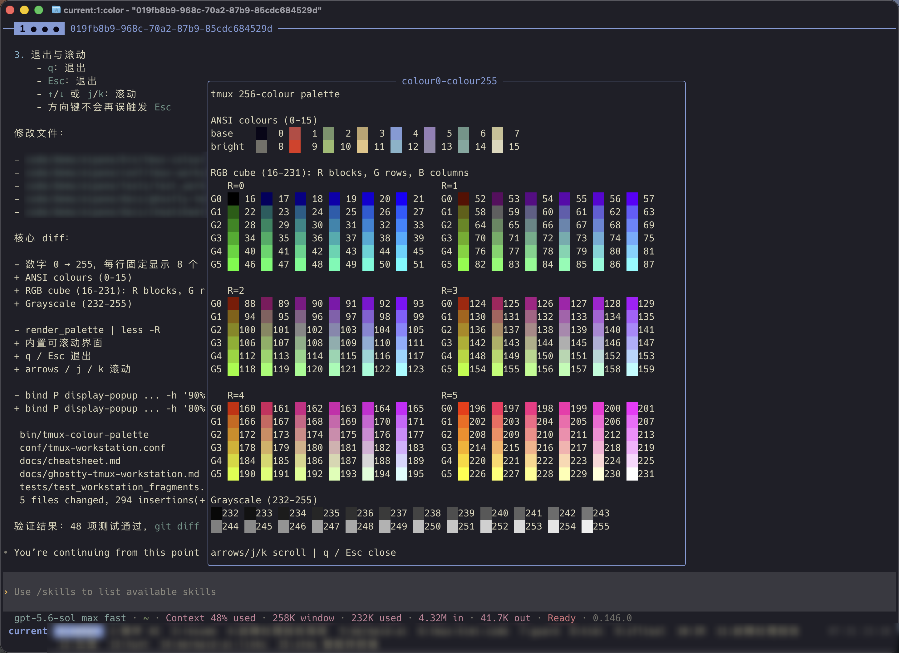
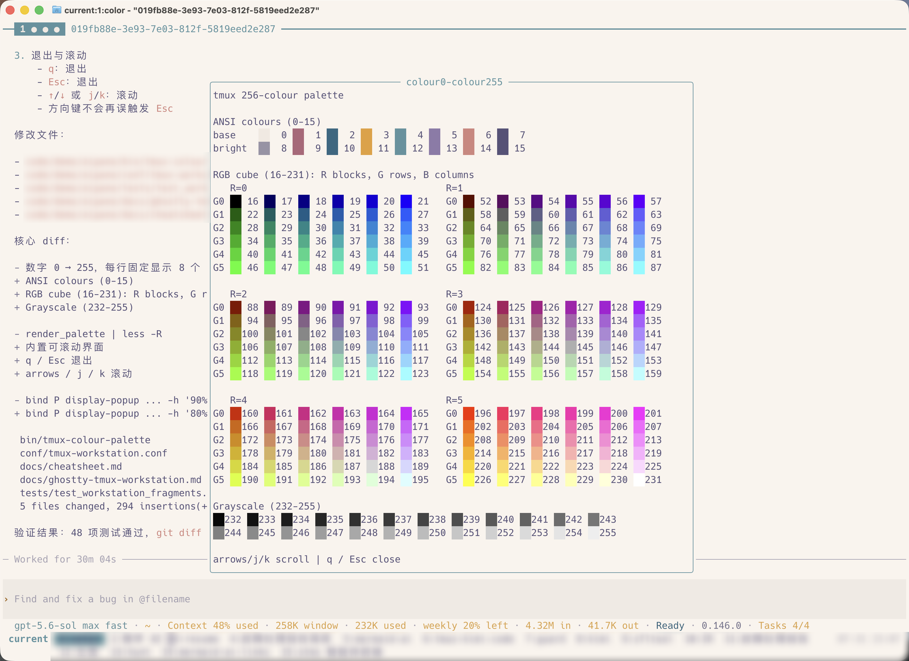

# aipane

用于日常 AI CLI 工作流的 zsh 工具集：通过 tmux 窗格编排多个 AI 工具、清理相关进程，以及可选的 **Ghostty + tmux 工作台**（Cmd 键位桥、广播输入、窗口标签多行换行）。

[English README](README.md)

## 功能

| 命令 / 表面 | 说明 |
|---|---|
| `ai [--new\|-n] [--layout\|-l <layout>] <tools_string> [tool_args...]` | 直接启动一个 AI CLI，或在 tmux 窗格中编排多个 CLI |
| `killcc [options]` | 清理已分离的 AI CLI 进程树和孤立的 AI 子进程 |
| `killmcp [options]` | 清理过期、已分离或孤立的 MCP 辅助进程 |
| `killrod [options]` | 强制清理匹配的 Rod/Leakless 浏览器进程和 Playwright `chrome-headless-shell` 进程 |
| 可选 Ghostty + tmux 工作台 | Cmd↔tmux 键位桥、广播、窗口标签多行（**不会**被 `init.zsh` 加载） |

> [!WARNING]
> 部分 `ai` 启动器（含 `ai c` 启动 Claude Code）会关闭对应工具的审批检查；清理命令会终止进程。请先确认命令定义，不确定时先用 `--dry-run` 检查清理范围。

## 安装

```bash
git clone https://github.com/Async23/aipane.git ~/.aipane
grep -qxF 'source ~/.aipane/init.zsh' ~/.zshrc 2>/dev/null ||
  printf '\nsource ~/.aipane/init.zsh\n' >> ~/.zshrc
source ~/.zshrc
```

更新已有安装：

```bash
git -C ~/.aipane pull --ff-only
```

## 依赖

- macOS 和 zsh
- Claude Code：供 `ai` 的 `c` 工具使用（不用 `c` 时可省略）
- tmux：供多工具 `ai` 调用，以及使用 `--new` 或 `--layout` 时使用
- 其他 `ai` 工具对应的可选 CLI：Codex、Droid、Grok、OpenCode、Cursor CLI、Qoder CLI、Pi（`pi`）或 Kimi Code（`kimi`）

`ai x` 这类单工具调用默认在当前 shell 中运行；未使用 `--new` 或 `--layout` 时不依赖 tmux。

## 可选：Ghostty + tmux 工作台

为多 AI CLI 窗格准备的终端壳层。**不会**被 `init.zsh` 加载。个人字体/主题/TPM 仍放本机；公共片段只做 **include/source**。

| 部分 | 作用 |
|------|------|
| Ghostty Cmd 桥 | `Cmd+S` prefix；单次 `Cmd+T/W/D/[]/…`；`Cmd+I` 中央弹窗重命名；`Cmd+Opt+P` 显示 pane ID |
| Shift+Enter | tmux 里给 Codex 等稳定换行（→ Ctrl+J） |
| tmux workstation | 数字连按跳窗、zoom 保持导航、广播/单格豁免、pane 顶栏、256 色表、vi 复制 |
| window-wrap | 状态栏窗口标签最多 3 行 |
| copy-mode `Y` | 可选长截图，依赖 [tmux-shot](https://github.com/Async23/tmux-shot) |

**深色主题**



**浅色主题**



```bash
AIPANE_ROOT="${AIPANE_ROOT:-$HOME/.aipane}"
mkdir -p ~/.local/bin
ln -sf "$AIPANE_ROOT/bin/aipane-doctor" ~/.local/bin/aipane-doctor
ln -sf "$AIPANE_ROOT/bin/tmux-rename-window-popup" ~/.local/bin/tmux-rename-window-popup
ln -sf "$AIPANE_ROOT/bin/tmux-colour-palette" ~/.local/bin/tmux-colour-palette
ln -sf "$AIPANE_ROOT/bin/tmux-window-jump" ~/.local/bin/tmux-window-jump
ln -sf "$AIPANE_ROOT/bin/aipane-activity" ~/.local/bin/aipane-activity
ln -sf "$AIPANE_ROOT/bin/tmux-window-wrap" ~/.local/bin/tmux-window-wrap
ln -sf "$AIPANE_ROOT/bin/ai-restart" ~/.local/bin/ai-restart
```

重命名弹窗要求 `PATH` 中存在 `fzf`。

**Ghostty**（`~/.config/ghostty/config`）— 个人外观 + include：

```ini
config-file = /path/to/aipane/conf/ghostty-tmux.conf
```

**tmux**（`~/.tmux.conf`）：

```tmux
source-file ~/.aipane/conf/tmux-workstation.conf
source-file ~/.aipane/conf/tmux-window-wrap.conf
```

| 路径 | 作用 |
|------|------|
| `conf/ghostty-tmux.conf` | Cmd 桥 + Shift+Enter |
| `conf/tmux-workstation.conf` | prefix、键位、广播、状态栏样式 |
| `conf/tmux-window-wrap.conf` | 窗口列表多行 |
| `bin/aipane-doctor` | 只读检查安装与 Agent Activity 布线 |
| `bin/tmux-rename-window-popup` | 中央弹窗、稳定目标的窗口重命名 UI |
| `bin/tmux-colour-palette` | 终端索引色表（`0–255`） |
| `bin/tmux-window-jump` | 同数字连按、精确 index 的窗口选择器 |
| `bin/tmux-window-wrap` | 渲染 CLI |
| `bin/aipane-activity` | Agent Activity CLI |
| `bin/ai-restart` | 原地安全重启并续接可恢复的 AI pane |
| `bin/aipane-restore-executor` | 带验证、重试和持久 pending 意图的恢复执行器 |
| [`integrations/`](integrations/README.md) | Agent 生命周期 hook 片段与 OpenCode Adapter |
| `tests/test_agent_activity.py` | Agent Activity 行为测试 |
| `tests/test_agent_activity_integrations.py` | Agent Activity 契约测试 |
| `tests/test_restore_executor.py` | 恢复验证、重试与 pending 意图测试 |
| `tests/test_tmux_window_jump.py` | window-jump 行为 + 真 tmux 测试 |
| `tests/test_tmux_window_wrap.py` | window-wrap 单元 + 真 tmux 测试 |
| `tests/test_workstation_fragments.py` | conf 片段结构测试 |
| [`docs/ghostty-tmux-workstation.md`](docs/ghostty-tmux-workstation.md) | 安装与所有权 |
| [`docs/cheatsheet.md`](docs/cheatsheet.md) | 键位速查 |
| [`docs/tmux-window-wrap.md`](docs/tmux-window-wrap.md) | 换行与 Agent Activity 说明 |

安装后或拉取 workstation 变更后运行 `aipane-doctor`。

改 workstation conf 或 wrap 渲染器后：

```bash
python3 "$AIPANE_ROOT/tests/test_aipane_doctor.py"
python3 "$AIPANE_ROOT/tests/test_agent_activity.py"
python3 "$AIPANE_ROOT/tests/test_agent_activity_integrations.py"
python3 "$AIPANE_ROOT/tests/test_tmux_window_jump.py"
python3 "$AIPANE_ROOT/tests/test_workstation_fragments.py"
python3 "$AIPANE_ROOT/tests/test_tmux_window_wrap.py"
```

若 Ghostty 已在运行，用 **Cmd+Shift+,**（`reload_config`）重载配置以加载 include。

## 可选配置

在加载 `init.zsh` 之前设置覆盖值：

```bash
export AIPANE_CLAUDE_LAUNCH_CMD="claude --dangerously-skip-permissions"
export AIPANE_CODEX_LAUNCH_CMD="codex --yolo"
export AIPANE_DROID_LAUNCH_CMD="droid"
export AIPANE_GROK_LAUNCH_CMD="grok --always-approve"
export AIPANE_OPENCODE_LAUNCH_CMD="opencode"
export AIPANE_CURSOR_LAUNCH_CMD="cursor-agent --force"
export AIPANE_QODER_LAUNCH_CMD="qodercli"
export AIPANE_PI_LAUNCH_CMD="pi"
export AIPANE_KIMI_LAUNCH_CMD="kimi --auto"
```

加载这些覆盖值后，`ai --help` 会显示实际生效的启动命令。

## `ai` 启动器

工具键及其默认命令：

| 键 | 工具 | 默认命令 |
|---|---|---|
| `c` | Claude Code | `claude --dangerously-skip-permissions` |
| `x` | Codex | `codex --yolo` |
| `d` | Droid | `droid` |
| `g` | Grok | `grok --always-approve` |
| `o` | OpenCode | `opencode` |
| `r` | Cursor | `cursor-agent --force` |
| `q` | Qoder | `qodercli` |
| `p` | Pi | `pi` |
| `k` | Kimi Code | `kimi --auto` |

示例：

```bash
ai x                                      # 在当前 shell 中运行单个工具
ai x resume <session-id>                  # 向单个工具透传参数
ai x -- --help                            # 把类似 ai 选项的参数传给工具
ai --new x resume <session-id>            # 在新的 tmux 窗口或会话中运行

ai cxdg                                   # 每个字符对应一个窗格
ai cxr                                    # 交互选择三窗格布局
ai cxr --layout main-right                # 跳过三窗格布局选择
ai -l columns cxr
ai --new cxdg
ai cc                                     # 重复的键会启动重复的工具
```

可用布局：

- `auto`：自动网格，并跳过三窗格提示
- `main-left`、`main-right`：仅适用于恰好三个窗格的非对称布局
- `columns`、`rows`：每个工具独占一列或一行
- `1,2`、`2,1` 等自定义列数量；各数字之和必须等于工具数量

只有工具串包含一个工具时才能透传参数。多工具调用带额外参数会被拒绝，避免把不兼容参数同时发给多个 CLI。

在 tmux 内，只有当前窗口恰好包含一个窗格时才会复用该窗口；使用 `--new` 可新建窗口。在 tmux 外，窗格调用会创建临时会话并自动 attach。

## 重启 AI Pane

`ai-restart` 会刷新 tmux-resurrect 快照，找出拥有可恢复会话的 AI pane，
将这些 pane 重生为空闲 shell，再交给 `ai-restore` 续接原会话。pane ID、
布局和工作目录保持不变。恢复前会清理残留终端输入，并关闭受影响 tmux window
的 SYNC，避免不同 pane 的恢复命令被广播。瞬时失败会延迟重试，并且只有验证
成功后才重新绑定 pane。Grok 必须明确上报目标会话
`session loaded`，其他 Agent 则必须通过进程稳定期。未完成的恢复意图保存在
`~/.local/share/aipane/restore-pending.json`，不会再被后续 continuum 快照抹掉。
Qoder 和 Droid 因尚未支持会话恢复而直接忽略。

macOS 完成通知 Adapter 与声音覆盖入口统一记录在
[`docs/agent-notifications.md`](docs/agent-notifications.md)。

```bash
ai-restart --dry-run  # 刷新快照并预览，不重启 pane
ai-restart            # 预览、确认，然后重启并恢复
ai-restart --force    # 允许重启当前标记为 busy 的 pane
```

Pi 可以在不重启进程的情况下切换会话。安装 aipane 的 Pi 会话绑定 Adapter，
确保 `/new`、`/resume`、`/fork` 之后仍能恢复当前会话：

```bash
AIPANE_ROOT="${AIPANE_ROOT:-$HOME/.aipane}"
mkdir -p ~/.pi/agent/extensions ~/.local/bin
ln -sf "$AIPANE_ROOT/integrations/pi/aipane-bind.ts" \
  ~/.pi/agent/extensions/aipane-bind.ts
ln -sf "$AIPANE_ROOT/bin/aipane-bind" ~/.local/bin/aipane-bind
```

已经运行的 Pi 进程执行一次 `/reload` 即可加载。

默认情况下，只要选中的 Agent Activity 中有一个为 `busy`，整次操作就会中止。
旧 Agent 进程尚未上报状态时会显示 `unknown`，交互命令要求你明确确认所有任务均已
空闲。单独使用 `--yes` 不会接受 `unknown`；非交互场景必须显式使用 `--force`。
请从 tmux 外的独立终端运行该命令，以便安全替换所有选中的 AI pane。该功能依赖
tmux-resurrect 以及
[`docs/session-restore-design.md`](docs/session-restore-design.md) 中的会话恢复 hooks。

Pi 与 Claude 都可能已拥有预分配的 `--session-id`，但还没创建可持久恢复的
conversation。空 Pi 会话会重新打开空 TUI，并明确标为 `recreated`，绝不冒充已续接
的历史对话；若同一 Pi ID 实际属于其他项目或记录已损坏，仍标为 `invalid`。
Claude 仍要求存在持久 transcript，否则保持原 pane 不动。

## 进程清理

三个包装命令与统一清理引擎的对应关系：

```text
killcc  → aipane-cleanup ai  --verbose
killmcp → aipane-cleanup mcp --verbose --session-age 18000
killrod → aipane-cleanup rod --force --verbose
```

建议先执行 dry run：

```bash
killcc --dry-run
killmcp --dry-run
killrod --dry-run
```

直接调用方式：

```bash
./bin/aipane-cleanup [all|ai|rod|mcp] \
  [--all|--force] [--max-age SECONDS] [--orphan-age SECONDS] \
  [--session-age SECONDS] [--dry-run] [--verbose|-v] [--help|-h]
```

`ai` 模式会识别已分离的 Claude、Codex、Droid、Gemini、Grok、OpenCode 和 `agent-browser` daemon 进程，沿进程树收集相关进程，并检查已知的孤立 AI 子进程。传入 `--session-age` 后，还会清理超过指定时长的已分离 tmux Claude 会话树。

在 `rod` 模式中，`--force` 会忽略进程年龄，选中所有匹配的 Rod/Leakless Chromium 进程以及所有匹配的 `ms-playwright/.../chrome-headless-shell` 进程。

清理操作记录在 `~/logs/aipane-cleanup.log`。可通过以下环境变量覆盖时间阈值：

- `AIPANE_AI_ORPHAN_MAX_AGE`（默认 `900`）
- `AIPANE_AI_SESSION_MAX_AGE`（未设置时禁用）
- `AIPANE_ROD_MAX_AGE`（默认 `300`）
- `AIPANE_MCP_MAX_AGE`（默认 `21600`）
- `AIPANE_MCP_ORPHAN_MAX_AGE`（默认 `900`）
- `AIPANE_MCP_SESSION_MAX_AGE`（未设置时禁用）
- `AIPANE_TMUX_BIN`（可选的 tmux 显式路径）

## 项目结构

```text
.
├── init.zsh                 # zsh 入口
├── aipane.zsh               # 兼容入口
├── lib/core.zsh
├── lib/agent_activity.py    # Agent Activity 策略与证据 Adapter
├── lib/agent_notifications.py # 通知适配与投递策略
├── cmd/                     # ai/pane 与 kill* 命令
├── bin/
│   ├── aipane-cleanup
│   ├── aipane-doctor
│   ├── aipane-activity
│   ├── aipane-claude-activity
│   ├── ai-restart
│   ├── ai-restore
│   ├── aipane-restore-executor
│   ├── rod-cleanup
│   ├── tmux-rename-window-popup
│   ├── tmux-colour-palette
│   ├── tmux-window-jump
│   └── tmux-window-wrap     # 可选状态栏渲染器
├── conf/                    # 可选；不会被 init.zsh 加载
│   ├── ghostty-tmux.conf
│   ├── tmux-workstation.conf
│   └── tmux-window-wrap.conf
├── integrations/            # AI Tool Agent Activity Adapter
│   ├── claude/
│   ├── codex/
│   ├── cursor/
│   ├── grok/
│   ├── kimi/
│   ├── opencode/
│   ├── pi/
│   └── qoder/
├── docs/
│   ├── agent-notifications.md
│   ├── cheatsheet.md
│   ├── ghostty-tmux-workstation.md
│   └── tmux-window-wrap.md
└── tests/
    ├── ai-contracts.zsh
    ├── ai-p-launches-pi.zsh
    ├── aipane-cleanup-ai-protection.sh
    ├── aipane-cleanup-contracts.sh
    ├── init-reload.zsh
    ├── test_ai_restart.py
    ├── test_aipane_doctor.py
    ├── test_agent_activity.py
    ├── test_agent_activity_integrations.py
    ├── test_agent_notification_sounds.py
    ├── test_agent_notifications.py
    ├── test_kimi_notify.py
    ├── test_session_restore.py
    ├── test_tmux_window_jump.py
    ├── test_tmux_window_wrap.py
    └── test_workstation_fragments.py
```

## 验证

```bash
zsh -n init.zsh aipane.zsh cmd/*.zsh lib/*.zsh tests/*.zsh
sh -n bin/aipane-cleanup bin/aipane-claude-activity bin/rod-cleanup bin/tmux-colour-palette bin/tmux-rename-window-popup bin/tmux-window-jump tests/*.sh

zsh -fc '
  source ./init.zsh
  type ai killcc killmcp killrod
  for retired in codexx geminii oc; do
    (( $+functions[$retired] || $+aliases[$retired] )) && exit 1
  done
  ai --help >/dev/null
'

./tests/init-reload.zsh
./tests/ai-p-launches-pi.zsh
./tests/ai-contracts.zsh
./tests/aipane-cleanup-ai-protection.sh
./tests/aipane-cleanup-contracts.sh

# 可选工作台 / window-wrap
python3 tests/test_ai_restart.py
python3 tests/test_aipane_doctor.py
python3 tests/test_agent_activity.py
python3 tests/test_agent_activity_integrations.py
python3 tests/test_agent_notification_sounds.py
python3 tests/test_agent_notifications.py
python3 tests/test_kimi_notify.py
python3 tests/test_session_restore.py
python3 tests/test_restore_executor.py
node --experimental-strip-types --test tests/pi-session-binding.test.mjs
python3 tests/test_tmux_window_jump.py
python3 tests/test_workstation_fragments.py
python3 tests/test_tmux_window_wrap.py
```

## 许可证

MIT
